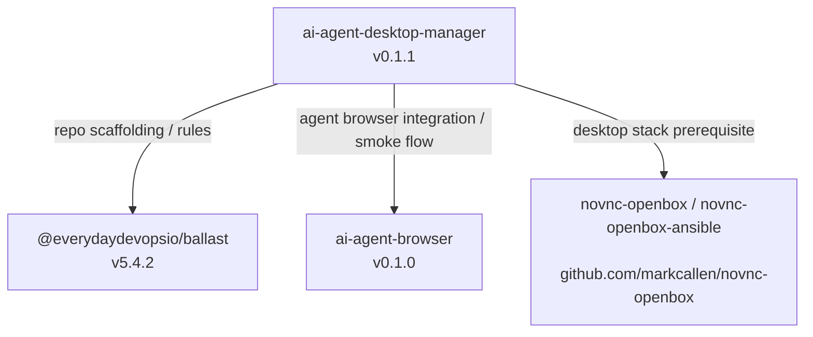

# First-Party Dependency Graph

This document maps the `markcallen` and `everydaydevopsio` projects used by `ai-agent-desktop-manager`.

## Summary

The first-party dependency graph is shallow:

- `ai-agent-desktop-manager` depends directly on `@everydaydevopsio/ballast` for repo governance and generated agent rules
- `ai-agent-desktop-manager` depends directly on `ai-agent-browser` for the browser-control plane used by agents
- `ai-agent-desktop-manager` depends operationally on the `novnc-openbox` stack for the VNC/Openbox/nginx desktop substrate

## Graph

## Versioned Inventory

| Project                                   | Owner              | How it is used here                                                                  | Version evidence                                          |
| ----------------------------------------- | ------------------ | ------------------------------------------------------------------------------------ | --------------------------------------------------------- |
| `@everydaydevopsio/ballast`               | `everydaydevopsio` | Generates `AGENTS.md`, `CLAUDE.md`, and `.claude/rules/*`; pinned in `.rulesrc.json` | `.rulesrc.json`: `5.4.2`                                  |
| `ai-agent-browser`                        | `markcallen`       | Agent-facing browser control service; packaged and deployed by the EC2 smoke flow    | [`docs/ec2-smoke-test.md`](./ec2-smoke-test.md); `v0.1.0` |
| `novnc-openbox` / `novnc-openbox-ansible` | `markcallen`       | Desktop substrate fronted by this manager's nginx routes and lifecycle control       | [`README.md`](../README.md); consumed via Ansible role    |

## Management Notes

1. **Ballast version drift**: track upgrades via `.rulesrc.json`.
2. **`ai-agent-browser` compatibility**: if wire protocol, CLI behavior, default ports, or packaging change, the smoke flow and operator workflow can break.
3. **`novnc-openbox`**: consumed as an Ansible role (see [`infra/ansible/requirements.yml`](../infra/ansible/requirements.yml)); treat the pinned role version as the stable reference.
