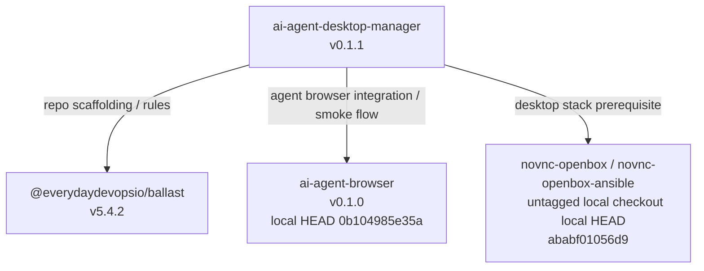

# First-Party Dependency Graph

This document maps the `markcallen` and `everydaydevopsio` projects used by [`ai-agent-desktop-manager`](/home/marka/src/ai-agent-desktop-manager/README.md).

It is based on:

- Direct repo metadata in this project
- Runtime and smoke-test references in this project
- Local source checkouts under `~/src`
- The dependency manifests and lockfiles of each referenced first-party project

## Summary

Today the first-party dependency graph is shallow:

- `ai-agent-desktop-manager` depends directly on `@everydaydevopsio/ballast` for repo governance and generated agent rules
- `ai-agent-desktop-manager` depends directly on `ai-agent-browser` for the browser-control plane used by agents
- `ai-agent-desktop-manager` depends operationally on the `novnc-openbox` stack, represented locally by the `novnc-openbox-ansible` repo
- No additional `markcallen` or `everydaydevopsio` repos were found as transitive dependencies of those three projects

## Graph

## Versioned Inventory

| Project                                   | Owner              | How it is used here                                                                                                                                                                                                                                        | Version evidence                                                                                                                                                                                                                                                                                                                                                                                             | Transitive first-party deps found |
| ----------------------------------------- | ------------------ | ---------------------------------------------------------------------------------------------------------------------------------------------------------------------------------------------------------------------------------------------------------- | ------------------------------------------------------------------------------------------------------------------------------------------------------------------------------------------------------------------------------------------------------------------------------------------------------------------------------------------------------------------------------------------------------------ | --------------------------------- |
| `ai-agent-desktop-manager`                | `markcallen`       | Root project                                                                                                                                                                                                                                               | [`package.json`](/home/marka/src/ai-agent-desktop-manager/package.json): `0.1.1`                                                                                                                                                                                                                                                                                                                             | N/A                               |
| `@everydaydevopsio/ballast`               | `everydaydevopsio` | Generates [`AGENTS.md`](/home/marka/src/ai-agent-desktop-manager/AGENTS.md), [`CLAUDE.md`](/home/marka/src/ai-agent-desktop-manager/CLAUDE.md), and `.codex/rules/*`; pinned in [`/.rulesrc.json`](/home/marka/src/ai-agent-desktop-manager/.rulesrc.json) | [`AGENTS.md`](/home/marka/src/ai-agent-desktop-manager/AGENTS.md) and [`/.rulesrc.json`](/home/marka/src/ai-agent-desktop-manager/.rulesrc.json): `5.4.2`; local tag commit `91a70b1b0098`                                                                                                                                                                                                                   | None found                        |
| `ai-agent-browser`                        | `markcallen`       | Agent-facing browser control service; required by smoke flow and documented as the agent access path                                                                                                                                                       | [`docs/ec2-smoke-test.md`](/home/marka/src/ai-agent-desktop-manager/docs/ec2-smoke-test.md), [`scripts/ec2-smoke-test.sh`](/home/marka/src/ai-agent-desktop-manager/scripts/ec2-smoke-test.sh), [`README.md`](/home/marka/src/ai-agent-desktop-manager/README.md); local manifest [`~/src/ai-agent-browser/package.json`](/home/marka/src/ai-agent-browser/package.json): `0.1.0`; local HEAD `0b104985e35a` | None found                        |
| `novnc-openbox` / `novnc-openbox-ansible` | `markcallen`       | Desktop substrate that this manager fronts with nginx routes and per-desktop control                                                                                                                                                                       | [`README.md`](/home/marka/src/ai-agent-desktop-manager/README.md) names the `novnc-openbox` project as the expected stack; local checkout is [`~/src/novnc-openbox-ansible`](/home/marka/src/novnc-openbox-ansible/README.md) with no release tag or package version; local HEAD `ababf01056d9`                                                                                                              | None found                        |

## Evidence By Dependency

### 1. `@everydaydevopsio/ballast`

This repo is Ballast-managed.

Evidence:

- [`AGENTS.md`](/home/marka/src/ai-agent-desktop-manager/AGENTS.md) says it was created by Ballast `v5.4.2`
- [`CLAUDE.md`](/home/marka/src/ai-agent-desktop-manager/CLAUDE.md) says it was created by Ballast `v5.4.2`
- [`.rulesrc.json`](/home/marka/src/ai-agent-desktop-manager/.rulesrc.json) records `"ballastVersion": "5.4.2"`

Transitive scan:

- Local source repo: [`~/src/ballast/packages/ballast-typescript/package.json`](/home/marka/src/ballast/packages/ballast-typescript/package.json)
- Published package version in local source: `5.5.0`
- Version actually installed into this repo: `5.4.2`
- No additional `markcallen` or `everydaydevopsio` package dependencies were found in [`~/src/ballast/pnpm-lock.yaml`](/home/marka/src/ballast/pnpm-lock.yaml)

Management implication:

- You need to actively manage Ballast upgrades for this repo because the local Ballast source is already ahead of the version recorded here (`5.5.0` exists locally, this repo is on `5.4.2`)

### 2. `ai-agent-browser`

This is a real product dependency, not just a doc mention.

Evidence:

- [`README.md`](/home/marka/src/ai-agent-desktop-manager/README.md) documents `ai-agent-browser` as the agent access layer
- [`scripts/ec2-smoke-test.sh`](/home/marka/src/ai-agent-desktop-manager/scripts/ec2-smoke-test.sh) requires a sibling checkout at `../ai-agent-browser`
- [`docs/ec2-smoke-test.md`](/home/marka/src/ai-agent-desktop-manager/docs/ec2-smoke-test.md) says the smoke flow packages the sibling `../ai-agent-browser` repo onto the host

Transitive scan:

- Local source repo: [`~/src/ai-agent-browser/package.json`](/home/marka/src/ai-agent-browser/package.json)
- Local project version: `0.1.0`
- No additional `markcallen` or `everydaydevopsio` dependencies were found in [`~/src/ai-agent-browser/pnpm-lock.yaml`](/home/marka/src/ai-agent-browser/pnpm-lock.yaml)

Management implication:

- If `ai-agent-browser` changes wire protocol, CLI behavior, default ports, or packaging shape, this project’s smoke flow and operator workflow can break

### 3. `novnc-openbox` / `novnc-openbox-ansible`

This is an operational platform dependency.

Evidence:

- [`README.md`](/home/marka/src/ai-agent-desktop-manager/README.md) says a working noVNC/Openbox stack is required and explicitly says the `novnc-openbox` project is the expected fit
- This project manages nginx routes and lifecycle around that stack rather than replacing it

Version note:

- The local repo present under `~/src` is [`novnc-openbox-ansible`](/home/marka/src/novnc-openbox-ansible/README.md)
- That checkout does not expose a normal application version in `package.json`, and the local repo has no release tags
- The best stable local identifier available is commit `ababf01056d9`

Transitive scan:

- No additional `markcallen` or `everydaydevopsio` repos were found in [`~/src/novnc-openbox-ansible/package-lock.json`](/home/marka/src/novnc-openbox-ansible/package-lock.json) or [`~/src/novnc-openbox-ansible/requirements.yml`](/home/marka/src/novnc-openbox-ansible/requirements.yml)

Management implication:

- Because this dependency is effectively versioned by checkout state, you should treat the commit SHA as the thing to pin and validate in smoke tests

## Not Counted As A Current Dependency

`env-secrets` was not counted in the graph for this repo.

Reason:

- It appears in the global agent framework at [`~/.agents/AGENTS.md`](/home/marka/.agents/AGENTS.md)
- It does not appear in this repository’s source, docs, scripts, workflows, or manifests
- None of the first-party dependencies scanned above pull it in as another first-party dependency

## What You Need To Manage

If you want this project to stay healthy, the first-party things to track are:

1. `ai-agent-desktop-manager` itself at `0.1.1`
2. Ballast version drift: this repo is on `5.4.2`, while local Ballast source already has `5.5.0`
3. `ai-agent-browser` compatibility at local version `0.1.0`
4. `novnc-openbox-ansible` by commit, because it is not currently giving you a stronger release version to pin against

## Recommended Next Step

The graph is currently small enough to manage manually, but the weak point is version pinning for operational dependencies.

The next pragmatic improvement would be to add a repo-owned dependency manifest for:

- required sibling project
- expected version or commit
- why it matters
- verification command

That would let you turn this document into something enforceable in smoke tests.
