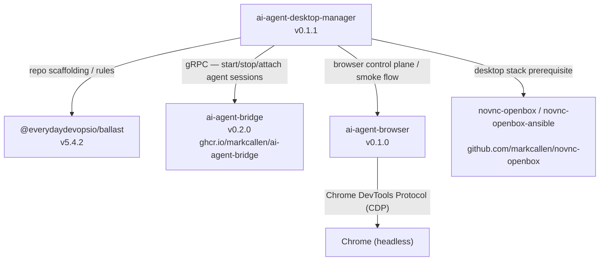

# First-Party Dependency Graph

This document maps the `markcallen` and `everydaydevopsio` projects used by `ai-agent-desktop-manager`.

## Summary

- `ai-agent-desktop-manager` depends directly on `@everydaydevopsio/ballast` for repo governance and generated agent rules
- `ai-agent-desktop-manager` depends at runtime on `ai-agent-bridge` — the gRPC service that spawns and manages AI agent sessions (Claude, etc.) inside PTYs
- `ai-agent-desktop-manager` depends at runtime on `ai-agent-browser` — the service that lets AI agents control a headless Chrome instance via CDP
- `ai-agent-desktop-manager` depends operationally on the `novnc-openbox` stack for the VNC/Openbox/nginx desktop substrate

`ai-agent-bridge` and `ai-agent-browser` are independent services with no dependency on each other.

## Graph

## Service Roles

| Service            | Role                                                                                                                                                                             |
| ------------------ | -------------------------------------------------------------------------------------------------------------------------------------------------------------------------------- |
| `ai-agent-bridge`  | gRPC server (port 9445). Spawns AI agent CLIs (Claude, Codex, Gemini, OpenCode) in PTYs, streams I/O, and manages session lifecycle. AADM connects to it via `AADM_BRIDGE_ADDR`. |
| `ai-agent-browser` | Controls a headless Chrome instance over CDP (port 9222). Exposes its own API on port 8765. Used by agents for browser-based tasks. Not a gRPC bridge.                           |

## Versioned Inventory

| Project                                   | Owner              | How it is used here                                                                                              | Version evidence                                          |
| ----------------------------------------- | ------------------ | ---------------------------------------------------------------------------------------------------------------- | --------------------------------------------------------- |
| `@everydaydevopsio/ballast`               | `everydaydevopsio` | Generates `AGENTS.md`, `CLAUDE.md`, and `.claude/rules/*`; pinned in `.rulesrc.json`                             | `.rulesrc.json`: `5.4.2`                                  |
| `ai-agent-bridge`                         | `markcallen`       | gRPC agent-session broker; AADM connects via `AADM_BRIDGE_ADDR`; image from `ghcr.io/markcallen/ai-agent-bridge` | `docker-compose.yaml`: `v0.2.0`                           |
| `ai-agent-browser`                        | `markcallen`       | Headless-Chrome control plane for browser-using agents; packaged and deployed by the EC2 smoke flow              | [`docs/ec2-smoke-test.md`](./ec2-smoke-test.md); `v0.1.0` |
| `novnc-openbox` / `novnc-openbox-ansible` | `markcallen`       | Desktop substrate fronted by this manager's nginx routes and lifecycle control                                   | [`README.md`](../README.md); consumed via Ansible role    |

## Management Notes

1. **Ballast version drift**: track upgrades via `.rulesrc.json`.
2. **`ai-agent-bridge` compatibility**: if the gRPC proto surface, config schema, or provider CLI args change, update the vendored proto/client in `src/vendor/ai-agent-bridge/` and the local dev config in `local/bridge-local.yaml`.
3. **`ai-agent-browser` compatibility**: if wire protocol, CLI behavior, default ports, or packaging change, the smoke flow and operator workflow can break.
4. **`novnc-openbox`**: consumed as an Ansible role (see [`infra/ansible/requirements.yml`](../infra/ansible/requirements.yml)); treat the pinned role version as the stable reference.
